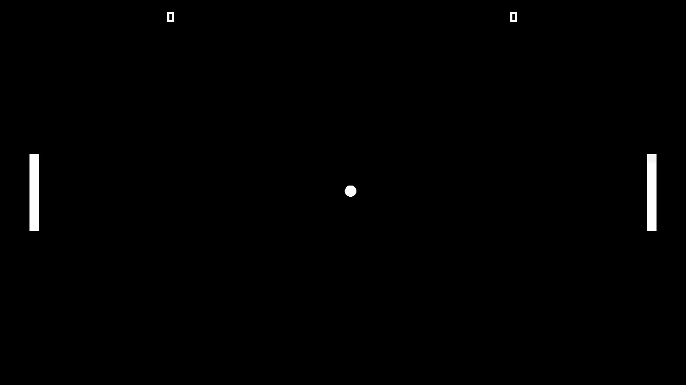

# [Unity/C#] Unit testing a Pong game (with Codemagic)

**Mina Pêcheux - January 2022**

Unit testing is a fundamental step in any automation process because it allows you to programmatically check if the features work properly, and it avoids code regressions! But it's not used that often by game developers, despite its benefits in terms of code quality, robustness and maintenance...

So, for example, how can we do unit testing in Unity for a basic game like Pong?

---

In this repo, I share a simple copy of the famous Pong game with a bunch of C# unit tests that use the [Unity Test Framework package](https://docs.unity3d.com/Packages/com.unity.test-framework@1.1/manual/index.html). The repo also uses continuous integration & continuous development (CI/CD) tools relying on [Codemagic](https://unitycicd.com/)'s workflows.

*For more info, check out the article [on Codemagic](https://blog.codemagic.io/unit-testing-automation-unity/)!*

